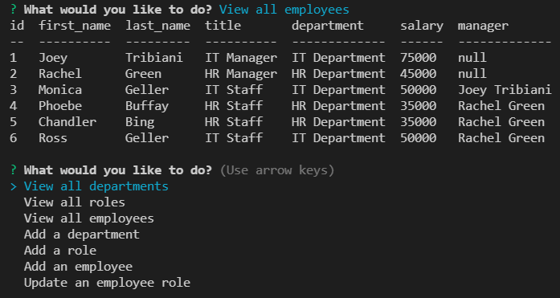

  # employee-tracker
  ## 
  ## A command-line application to manage a company's employee database, using Node.js, Inquirer, and MySQL.
  ------------------
  ## TECHNOLOGIES USED
  ### Node.js
  ### JavaScript
  ------------------
## SCREENSHOT

  ------------------
  ## INSTALLATION
  ### You must install the following for this app to function:
  ### Dependencies: 
  ### inquirer
  ### console.table
  ### mysql
  ### nodemon (optional)
  ------------------
  ## LICENSE  
  ### https://opensource.org/licenses/MIT
  ------------------
  ## DEPLOYMENT  
  ### https://christiandc19.github.io/employee-tracker/
  ### https://github.com/christiandc19/employee-tracker/
  ------------------
  ## QUESTIONS  
  ### If you have any questions, you may contact me at:
  ### Github: https://github.com/christiandc19 or,
  ### christiandc19@hotmail.com
